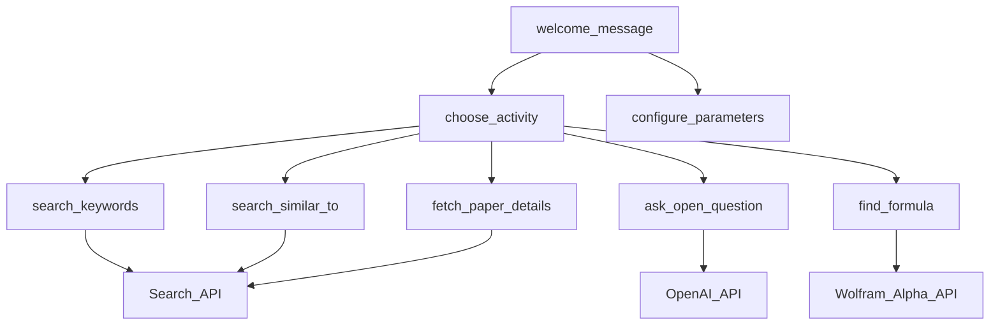
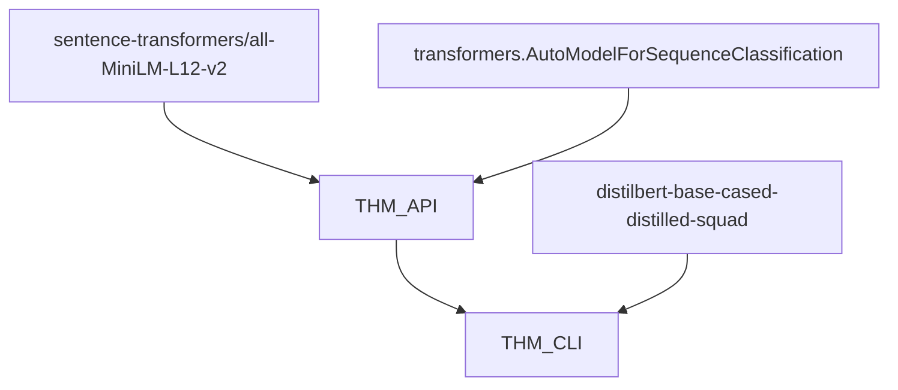

# Team THM Submission

<div align="center">
     <br/>
    <br/>
    Tom, Henrique, Michel, Corentin<br/>
    Oct. - Nov. 2022<br/>
    https://artefactory.github.io/redis-team-THM/<br/>
    https://thm-cli.community.saturnenterprise.io/api/docs<br/><br/>
</div>

This demo showcases the _vector search similarity_ feature of Redis Enterprise.

RediSearch enables developers to add documents and their embeddings indexes to the database, turning Redis into a vector database that can be used for modern data web applications.

[](https://asciinema.org/a/5e9QHIS62HZDL1VkSFtAVlvjF)

See [Architecture](#architecture) to see how it works, and [User Workflow](#user-workflow) to see how it can be used.

------------------------------

## Table of Contents

- [Documentation](#documentation)
- [History of Changes](#history-of-changes)
- [Machine Setup](#machine-setup)
- [Architecture](#architecture)
- [User Workflow](#user-workflow)
- [Running The Application](#running-the-application)
- [Benchmarks](#benchmarks)

------------------------------

## Documentation

- [Basic Demo](https://docsearch.redisventures.com) | [GitHub](https://github.com/RedisVentures/redis-arXiv-search)
- [Redis Vector Similarity Search](https://redis.io/docs/stack/search/reference/vectors)
- [Huggingface Tokenizers + Models](https://huggingface.co/sentence-transformers)
- [Cornell University - arXiv dataset](https://www.kaggle.com/Cornell-University/arxiv), `arxiv-metadata-oai-snapshot.json` file is used
- [`FastAPI`](https://fastapi.tiangolo.com/), [`pydantic`](https://pydantic-docs.helpmanual.io/), [`redis-om`](https://redis.io/docs/stack/get-started/tutorials/stack-python/)
- [`redis`](https://redis.io/docs/stack/) see Vector database and JSON storage

## History of Changes

- 1/11 - Added a multi-category classifier, a Question Answering engine and a CLI HTTP client to the backend
- 31/10 - Draft blog posts and CLI ETL tool
- 30/10 - Refactored `RedisVentures/redis-arXiv-search` project
- 27/10 - Setup Redis Cloud Enterprise and Saturn Cloud accounts and [organized](https://github.com/orgs/artefactory/projects/7) within the team
- 15/10 - Added a blog based on [Pelican](https://getpelican.com)
- 15/10 - Added CI/CD script
- 15/10 - Forked from [`RedisVentures/redis-arXiv-search`](https://github.com/RedisVentures/redis-arXiv-search)

## Machine Setup

```sh
brew install yarn redis docker
pip install -r backend/requirements.txt
pip install -r scripts/requirements.txt
```

## Architecture

The user will perform searches to the Redis database through a REST API HTTP Server.

We wrote a small interactive CLI client tool that performs calls to the HTTP Server and returns papers matching the user queries.

```txt
                        writes pickle and loads index
+-------------------+      +----------------+
|                   |      |                |
|  Redis            +<-----+  ETL CLI       |
|                   |      |                |
+--------+----------+      +----------------+
         ^
         |  reads search index
+--------+----------+
|                   |
|  FastAPI          |
|                   |
+--------+----------+
         ^
         |  calls backend
+--------+----------+      +---------------------+
|                   |      |                     |
|  THM CLI          +----->+  arxiv.org          |
|                   |      |  wolfram.alpha.com  |
+-------------------+      +---------------------+
    researcher uses the THM CLI while writing research
```

## User Workflow

This CLI tool is a quick assistant for a researcher daily activities and helps him improves his efficiency.

It can be used with his text editor and browser and helps him in the process of:

- building bibliography in Markdown or BibTeX formats,
- checking the PDF papers using arXiv website,
- checking scientific facts on Wolfram Alpha website.



## Running The Application

### Run With Docker

```sh
docker compose up
open http://localhost:8888

# To force a new build
docker compose up --build

# To clear Docker cache
docker system prune
```

### Backend Application Only

Setup your Redis Enterprise Cloud then,

```sh
cd backend/
./start.sh

open http://0.0.0.0:8080/api/docs
```

[Deploy on Saturn Cloud](https://app.community.saturnenterprise.io/dash/resources?recipeUrl=https://github.com/artefactory/redis-team-THM/blob/main/backend/.saturn/thm-backend-deployment-recipe.json)

### Blog

```sh
# To preview files locally
pelican blog/content && pelican --listen

# To publish on GitHub pages
make publish_blog
```

### Machine Learning Models

The project uses the [`UKPLab/sentence-transformers`](https://github.com/UKPLab/sentence-transformers) library to compute dense vector representations for sentences found in [Cornell's arXiv corpus](https://www.kaggle.com/Cornell-University/arxiv).

We found the following models interesting NLP models from the [leaderboard](https://huggingface.co/spaces/mteb/leaderboard) that community built.

- `sentence-transformers/all-mpnet-base-v2` has embeddings of size 768 and relative good performance
- `sentence-transformers/all-MiniLM-L6-v2`
- `sentence-transformers/all-MiniLM-L12-v2` has embedding of size 384 and interesting for development as performing inference is faster

We also used [`transformers.AutoModelForSequenceClassification`](https://huggingface.co/transformers/v3.0.2/model_doc/auto.html#automodelforsequenceclassification) for the problem of multi-category classification.

For the problem of Question Answering we used [`distilbert-base-cased-distilled-squad`](https://huggingface.co/distilbert-base-cased-distilled-squad) for the problem of Question Answering.



## Benchmarks

From a file named `arxiv-metadata-oai-snapshot.json` containing metadata and abstracts of aout 2M papers in 153 different scientific categories, we generated partial indexes and evaluated how it can run in production considering:

- machine provisining needed,
- how to update regularly from the arXiv snapshots,
- volumetry of data.

### Generating Embeddings

First, we evaluated the Jupyter notebooks from Redis demo code [`RedisVentures/redis-arXiv-search`](https://github.com/RedisVentures/redis-arXiv-search/tree/main/data).

| Model                    | Machine                      | Time   |
|-------------------------:|------------------------------|-------:|
|            `arxiv-embeddings.ipynb` | [Apple M1 Pro 8-core](https://www.apple.com/macbook-pro-14-and-16/specs/) | 17min |
|            `arxiv-embeddings.ipynb` | [Saturn Cloud T4-XLarge 4-cores](https://saturncloud.io/plans/hosted/) | 4min |
| `single-gpu-arxiv-embeddings.ipynb` | T4-XLarge 4-cores, `saturn-python-rapids` image | 30min |

### Loading Index on Redis Cloud

| Model                    | Machine                      | Time   |
|-------------------------:|------------------------------|-------:|
| `arxiv_embeddings_10000.pkl` | [Apple M1 Pro 8-core](https://www.apple.com/macbook-pro-14-and-16/specs/) | 6min |

### Load testing the HTTP Server

Using [`wg/wrk`](https://github.com/wg/wrk)

```sh
$ wrk -t4 -c20 -d30s https://thm-cli.community.saturnenterprise.io/api/docs

Running 30s test @ https://thm-cli.community.saturnenterprise.io/api/docs
  4 threads and 20 connections

  Thread Stats   Avg      Stdev     Max   +/- Stdev
    Latency   105.53ms   21.50ms 461.06ms   88.24%
    Req/Sec    47.63      7.97    80.00     79.85%
  5629 requests in 30.11s, 5.74MB read
Requests/sec:    186.98
Transfer/sec:    195.19KB
```

## Contributions

Changes and improvements are welcome! Feel free to fork and open a pull request into `main`.