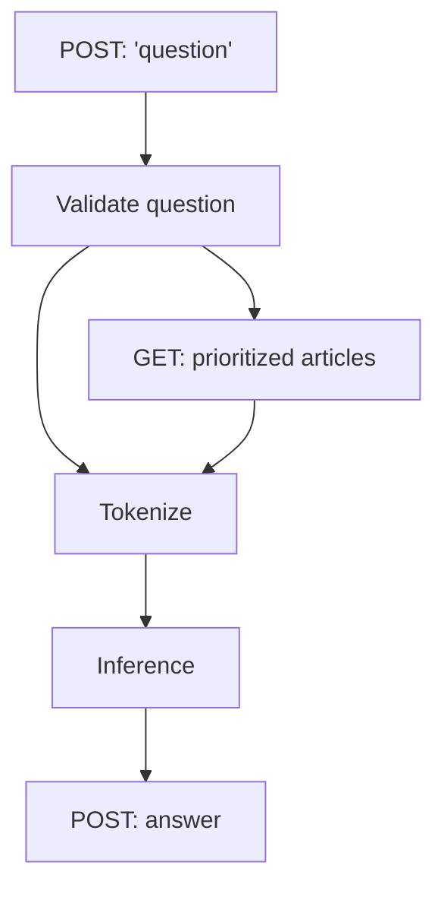

# Question Answering pipeline

TODO: document pipeline

```mermaid
flowchart TD;
	step1["POST: 'question'"]
	step2[Validate question]
	step3["GET: prioritized articles"]
	step4[Tokenize]
	step5[Inference]
	step6["POST: answer"]

  step1 --> step2
	step2 --> step3
	step2 --> step4
	step3 --> step4
	step4 --> step5
  step5 --> step6
```