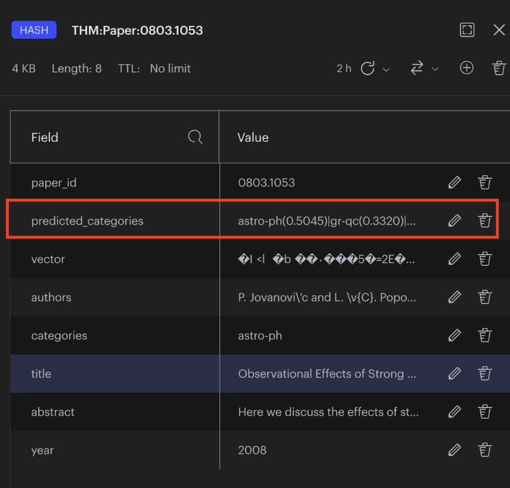

Title: Paper Classification Integration
Date: 2022-11-03 17:49
Modified: 2022-11-03 17:49
Category: Machine Learning
Tags: categories, huggingface, transformers
Slug: integrate-labels
Authors: Tom Darmon, Henrique Brito
Summary: pipelines, training, inferance

_Day 10 - Integrating the soft labels model to the pipeline

# Industrializing the soft labels model

We have created a classification model to quantify the categories of each item between 0 and 1. It is now important to industrialize our code by integrating this model and this code into our workflow.

The model we decided to use for the classification is [`bert-tiny`](https://huggingface.co/prajjwal1/bert-tiny) from the [huggingface hub](https://huggingface.co/models). Our goal is to make data retriaval fast, in order to avoid making predictions on the category every time a user is sending a query, we decided to make the inference offline and leverage redis speed to serve the metadata to the user.

# The step of the workflow

 We decided to split our classification pipeline in 3 steps:

- `training`: We train our model and store the resulting waits locally. As a next step it would be good to save the weights to a service such as [W&B](https://wandb.ai/site?utm_source=google&utm_medium=cpc&utm_campaign=Conversions%3A+Marketing+Site+-+Non-Branded+-+Dynamic+Search&utm_content=Baseline+-+1st+Ad&gclid=CjwKCAiA9qKbBhAzEiwAS4yeDfKlvTSoj2at5CSOCEidthehh-Bv85cS5XDQnLTi98v38YCOdhEFTBoCEc0QAvD_BwE) or [Artifact Registry](https://cloud.google.com/artifact-registry).
- `inference`: We use the weights of our trained model to do the inference on the dataset, this is the step where we obtain the soft labels between 0 and 1.
- `re-training`: This script [`scripts/retrain_model.sh`](../../scripts/retrain_model.sh)  retrains the model, it needs to be run if new papers are added to the dataset. As a next it would be good to create a [Cloud Function](https://cloud.google.com/functions) in order to automate the retraining of our model if new data is detected.

# Including the soft labels and the text encoding in redis

We decided to have only one [entry point](../../scripts/generate_index.py) to generate the meta data of every paper:

- `generate_index.py`: 
    - run the encoding for the text of evey paper
    - run the soft label inference pipeline
    - save the data in a pickle file

The final pickle file is then pushed to `redis` using [`load_data.py`](../../scripts/load_data.py).

One challenge we faced when pushing the categories to redis, is to chose a format to store the predicted categories whith there associated score. We decided to store them in a string, in order to store and retrieve the categories/values we had to [parse the string](scripts/helpers/category_parser.py).

As a next step it would be possible to chose a better [redis data type](https://redis.io/docs/data-types/tutorial/) than strings.

# Final result

If we are looking directly inside the redis database we can see our soft labels stored as a string:

    

